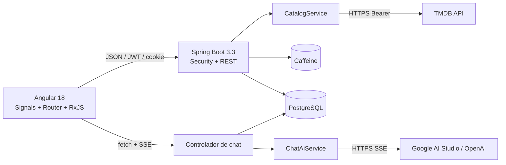

# Arquitectura



## Backend

`TmdbClient` concentra HTTP, Bearer, timeout, reintentos 429/5xx y `Retry-After`. DTOs internos modelan únicamente los campos usados. `MovieCatalogMapper` y `TvCatalogMapper` normalizan `title/release_date` y `name/first_air_date` a `CatalogSummary`/`CatalogDetail`. `CatalogService` compone Home y usa `append_to_response=videos,recommendations`; proveedores se consultan en el recurso verificado correspondiente.

Los controladores exponen solo contratos propios bajo `/api`. Caffeine separa listas, búsquedas, detalles y configuración con TTL de 30 minutos, 10 minutos, 12 horas y 24 horas. Las claves incluyen tipo, página, idioma, región y filtros. `sync=true` evita cargas simultáneas equivalentes.

Spring Security valida access JWT. El refresh opaco es otro JWT con `jti`, se guarda únicamente como SHA-256 y rota en cada uso. La cookie es HttpOnly, SameSite configurable y `Secure` en producción. CORS es configurable.

## Frontend

Home usa una sola llamada agregada. Los servicios mantienen el contrato compuesto; favoritos usan un `Set` de claves `MEDIA_TYPE:tmdbId`. El interceptor de errores comparte la renovación con `shareReplay`, evitando carreras. Las búsquedas usan debounce, `distinctUntilChanged` y `switchMap`.

El chat tiene un solo propietario de mensajes (`ChatComponent`). `ChatWindowComponent` emite intenciones. Antes de invocar al proveedor configurado, `ChatGroundingService` envía a TMDB una consulta saneada de hasta 100 caracteres, hidrata como máximo cuatro títulos y los incorpora como contexto verificado. `GeminiChatAiService` usa `streamGenerateContent`; `OpenAiChatAiService` conserva la alternativa Responses con `store:false`. Ambas integraciones limitan el historial a 12 mensajes y no incluyen JWT, correo ni datos de cuenta. El parser incremental conserva buffers entre chunks y entiende eventos SSE partidos:

Los errores externos se clasifican en mensajes públicos controlados (alta demanda, límite temporal, timeout, petición no válida, seguridad, configuración o indisponibilidad). El cuerpo y el mensaje originales del proveedor nunca se envían en los eventos SSE consumidos por Angular.

```text
event: meta   data: {"conversationId": 7}
event: references data: [{"tmdbId": 603, "mediaType": "MOVIE", ...}]
event: delta  data: {"text": "fragmento"}
event: done   data: {"conversationId": 7}
event: error  data: {"message": "..."}
```

## Confianza y datos externos

TMDB sigue siendo la fuente de verdad; PostgreSQL no replica el catálogo. El snapshot de un favorito permite una lista sin N+1. La disponibilidad procede de JustWatch mediante TMDB y puede faltar. La recomendación “Para ti” combina títulos relacionados de hasta tres favoritos con descubrimiento por sus géneros predominantes; excluye favoritos y duplicados y usa tendencias como respaldo. Es filtrado basado en contenido, no un modelo de ML propio.
